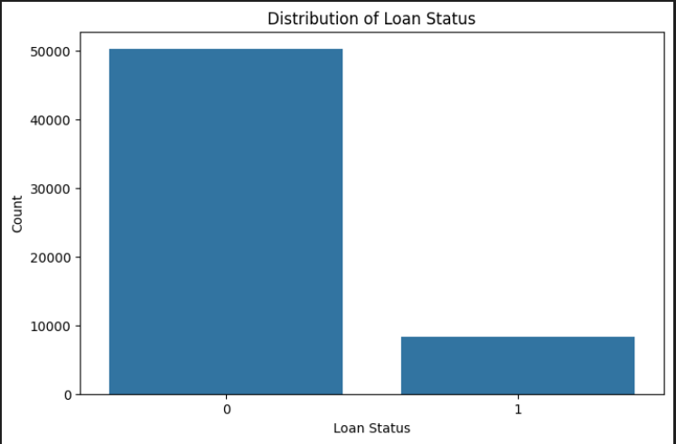
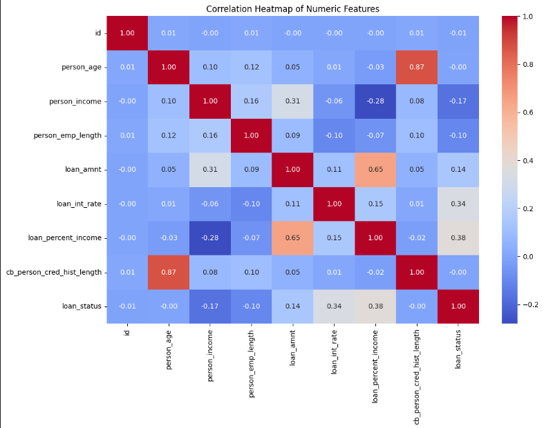
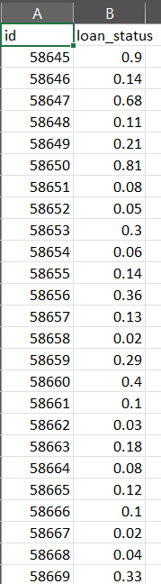

# **LOAN APPROVAL PREDICTION**

## **INTRODUCTION**
This project predicts the likelihood of loan approval based on various factors such as applicant characteristics, financial details, and loan history. The dataset provided contains information for both training and testing models, and the goal is to predict the probability of loan approval for each applicant in the test dataset.

## **DATASET**
The project uses the following files:

- train.csv: Contains the training dataset with features and a target variable loan_status (0 or 1).
- test.csv: Contains the test dataset for which loan approval predictions are required.
- sample_submission.csv: A sample submission file showing the format required for submission.

## **FILE STRUCTURE**
- Loan-Prediction
  - loan_prediction.py
  - README.md
  - sample_submission.csv
  - submission_final.csv
  - test.csv
  - train.csv

## **SETUP INSTRUCTIONS**

1. Clone the repository
  - git clone https://github.com/Sanj5/Loan-Prediction.git
  - cd Loan-Prediction

2. Install required dependencies
  - pip install pandas scikit-learn numpy

3. Run the project
  - python loan_prediction.py

4. Output
  - After running the script, you will find the predictions in a file named submission_final.csv. This file will be formatted with the columns id and loan_status.

## **GRAPHS EXPLAINING DATA SET**

## **OUTPUT**

The loan_status values represent the model's confidence in approving each loan application:
Scores close to 1.0 suggest a high likelihood of approval.
Scores close to 0.0 indicate a low likelihood of approval.

Example Interpretation
For example, the application with id 58645 has a loan status score of 0.9, suggesting a very high probability of approval.
Conversely, the application with id 58667 has a score of 0.02, indicating that the model predicts a low likelihood of loan approval.

  